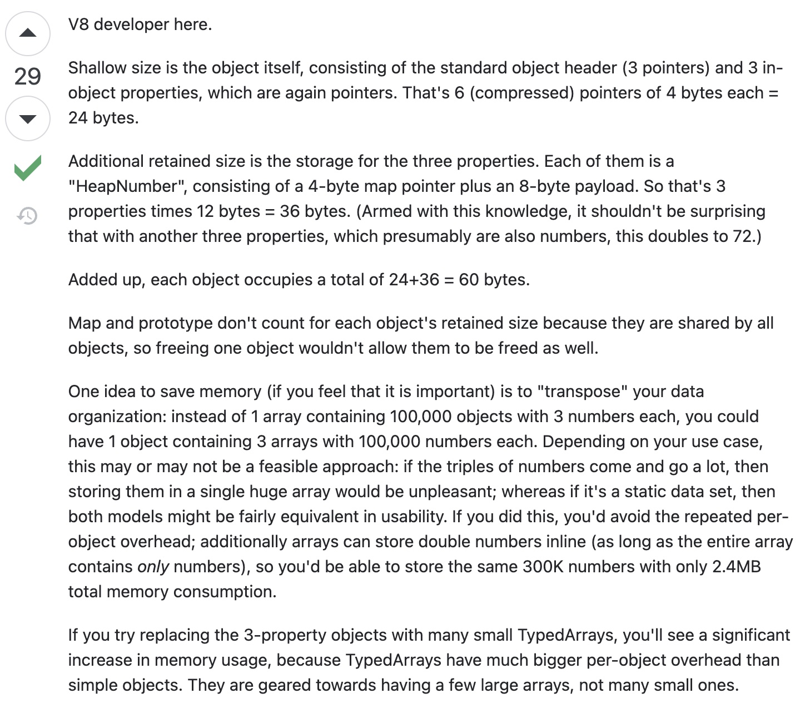
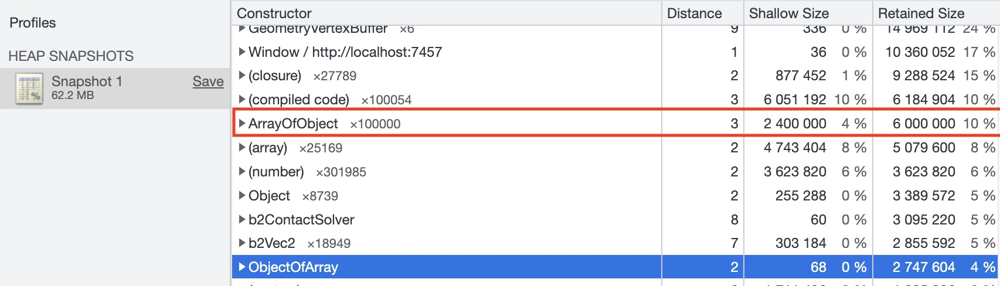

# Js Array Memory Problem

## StackOverflow Article

* <https://stackoverflow.com/questions/62049063/retained-size-in-chrome-memory-snapshot-what-exactly-is-being-retained>

  

## Test Code In Cocos Creator

```ts
class ObjectOfArray {
    public x: number[];
    public y: number[];
    public z: number[];

    constructor() {
        this.x = [];
        this.y = [];
        this.z = [];
    }
}

function genObjectOfArray() {
    // @ts-ignore
    const ooa = window.ooa = new ObjectOfArray();
    for (let i = 0; i < 100000; i++) {
        ooa.x.push(Math.random());
        ooa.y.push(Math.random());
        ooa.z.push(Math.random());
    }
}

class ArrayOfObject {
    public x: number;
    public y: number;
    public z: number;

    constructor(x: number, y: number, z: number) {
        this.x = x;
        this.y = y;
        this.z = z;
    }
}

function genArrayOfObject() {
    // @ts-ignore
    const arr = window.arr = [];
    for (let i = 0; i < 100000; i++) {
        arr.push(new ArrayOfObject(Math.random(), Math.random(), Math.random()));
    }
}


@ccclass('Test')
export class Test extends Component {

    start() {
        genArrayOfObject();
        genObjectOfArray();
    }
}

```

* After take memory snapshot

  
